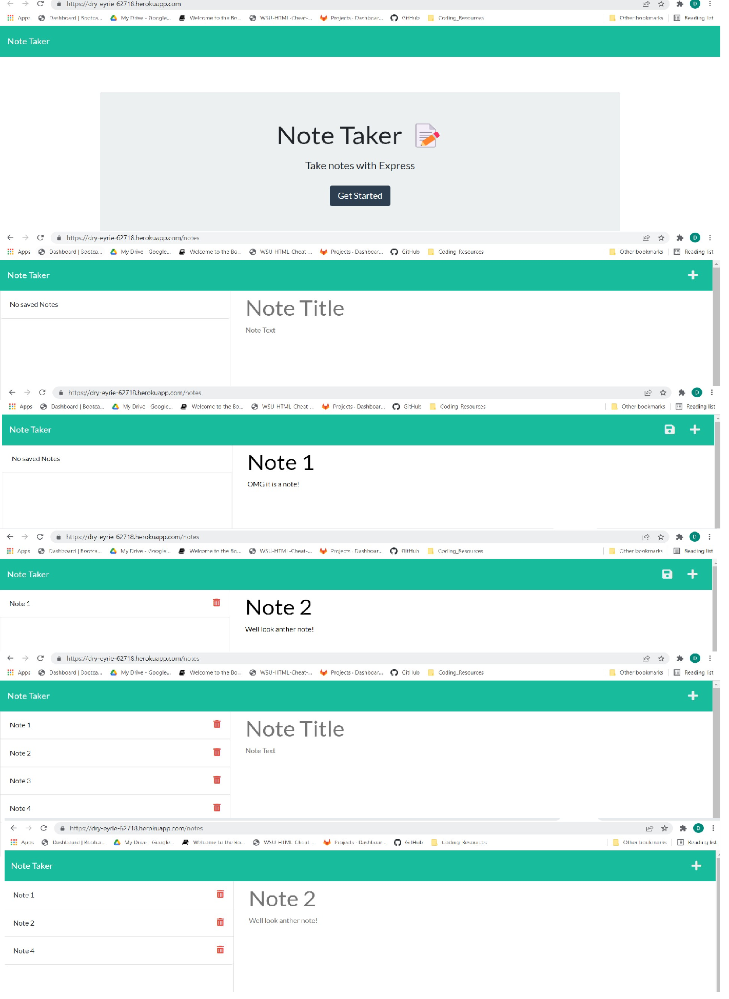

# [Notable Notes](https://github.com/DanielMrva/notable_notes) 
  
  ## Description
  Notable notes is an Express.js website that utilizes a basic database for taking down notes or reminders.  Notes persist through the database, and can be deleted when no longer required.

  ## Table of Conents
   1. [Usage](#usage)
   1. [Contribution](#contribution)
   1. [Questions](#questions)
   1. [Github Repository](#github-repository)
   1. [License](#license)
  
  ## Usage 
  After clicking on the central link, you are taken to the notes section.  Entering text in the main "Notes" section allows you to enter a note title and note text.  The save icon will then appear and the note can be saved.  Notes can be deleted with the "trashcan" icon.

  The images below are a composite showing a number of states of the website.

  

  ## Contribution
  Any contributions can be emailed to the email availible in the github link.
  
  ## Questions
  GitHub/Email

  Feel free to follow or contact me at my GitHub page: [DanielMrva](https://github.com/DanielMrva)
  
  
  ## Github Repository
  [Notable Notes](https://github.com/DanielMrva/notable_notes)
  [Deployed Site](https://dry-eyrie-62718.herokuapp.com/)
  
  ## License 
  MIT